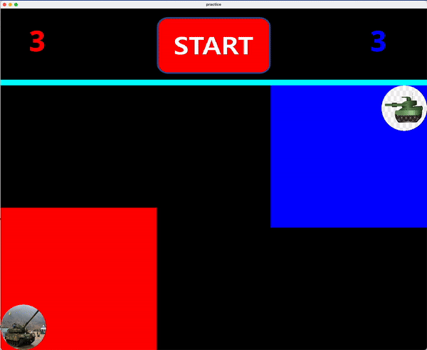
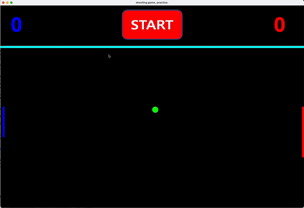
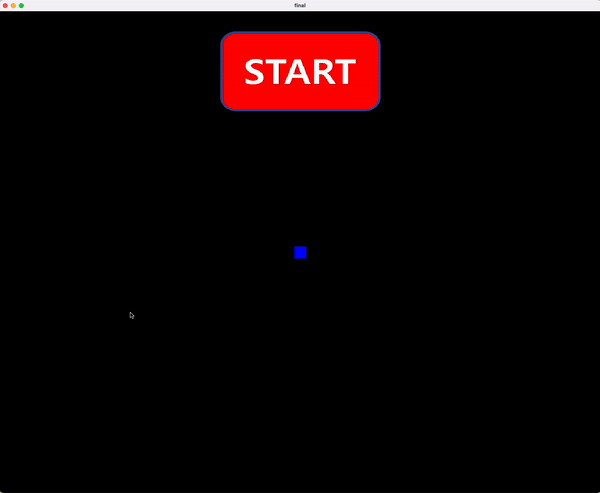

* 인천대학교 2학년 2학기 전공 `객체기반SW설계` 수업을 들으며 진행한 SFML을 이용한 게임 만들기 프로젝트입니다.
   * 0_practice/ : 연습 삼아 직접 게임을 구상 및 구현한 directory
   
   * 1_MID_FINAL/ : 중간고사 문제로 주어진 게임을 구현한 directory
   
   * 2_FINAL/ : 기말고사 문제로 주어진 게임을 구현한 directory
   